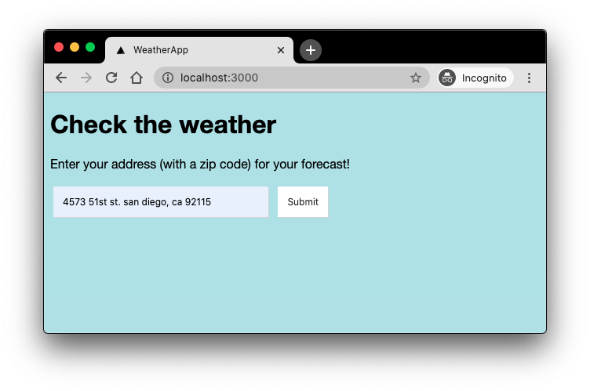
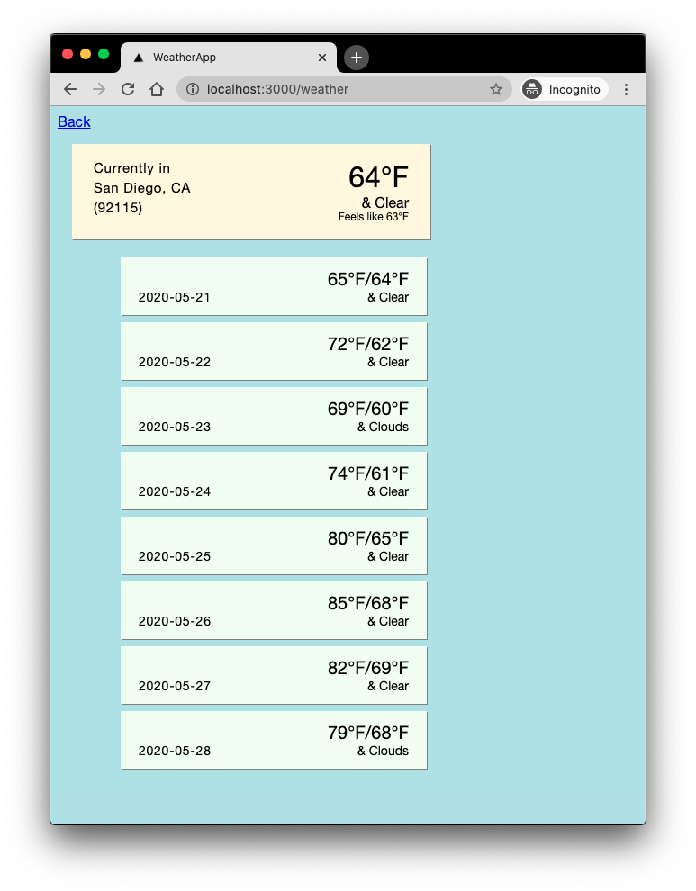
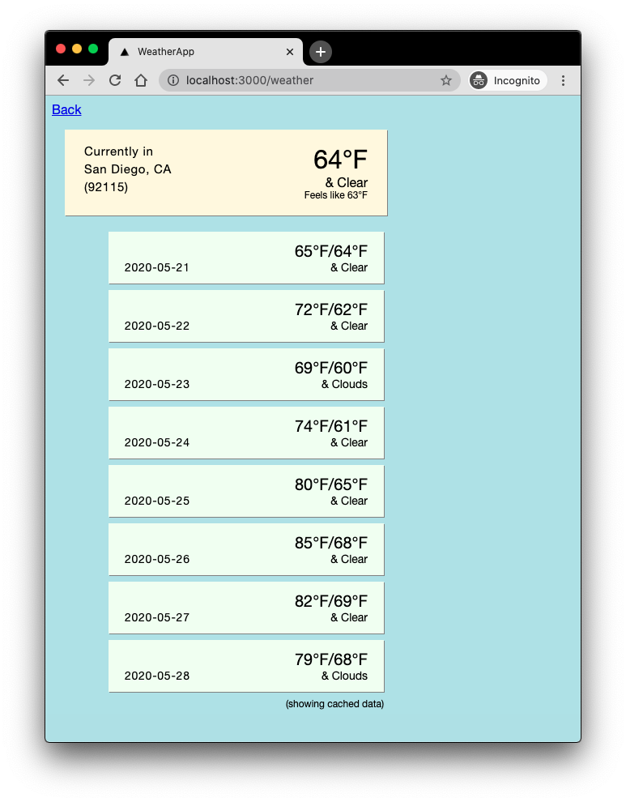

# Weather App

Clone the repo:

```bash
git clone git@github.com:edmundho/weather-app.git
```
or
```bash
git clone https://github.com/edmundho/weather-app.git
```

Install gems:

```bash
bundle
```

Launch the server:

```bash
rails s
```

Open <http://localhost:3000> in a browser.

## Using the app

Type in an address (zip code required) on the home page and click submit.


See your forecast (data not cached).


Click back, and submit again with the same address and see cached data.

